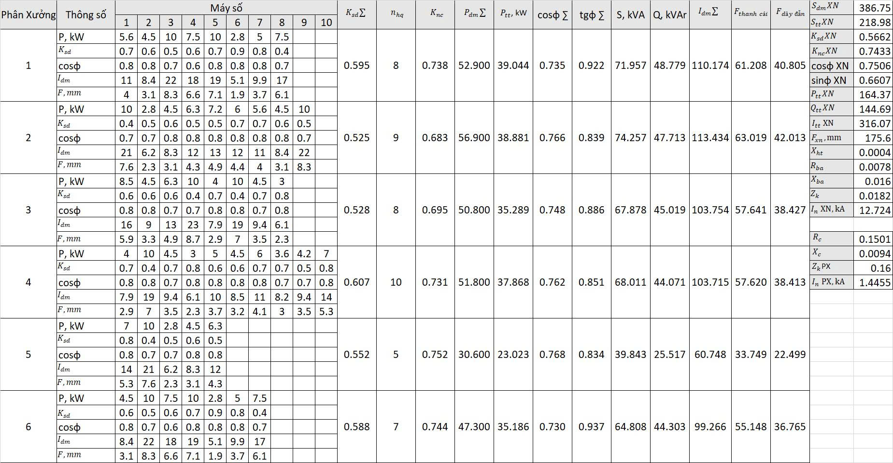
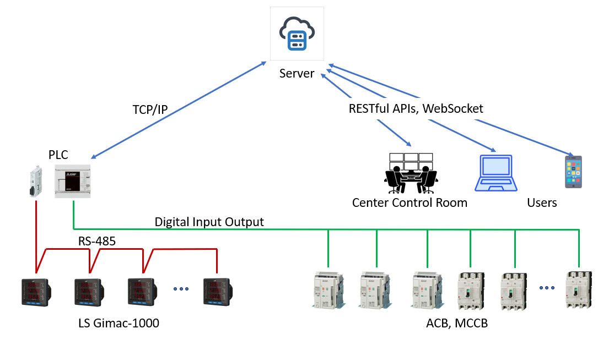
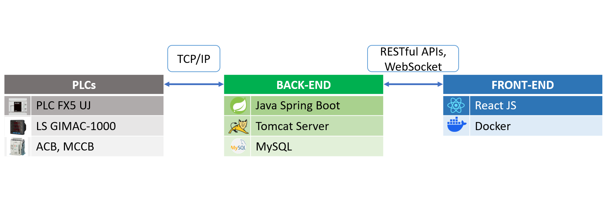
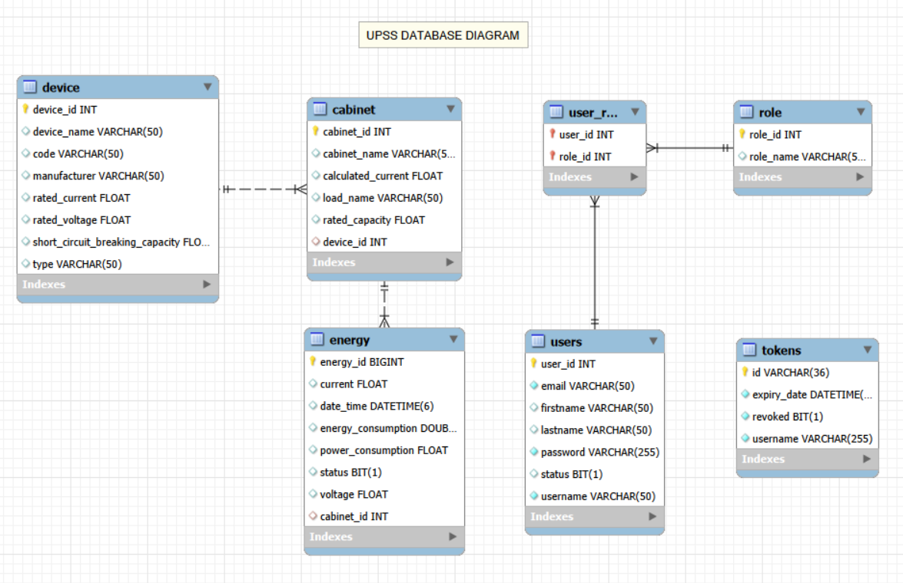
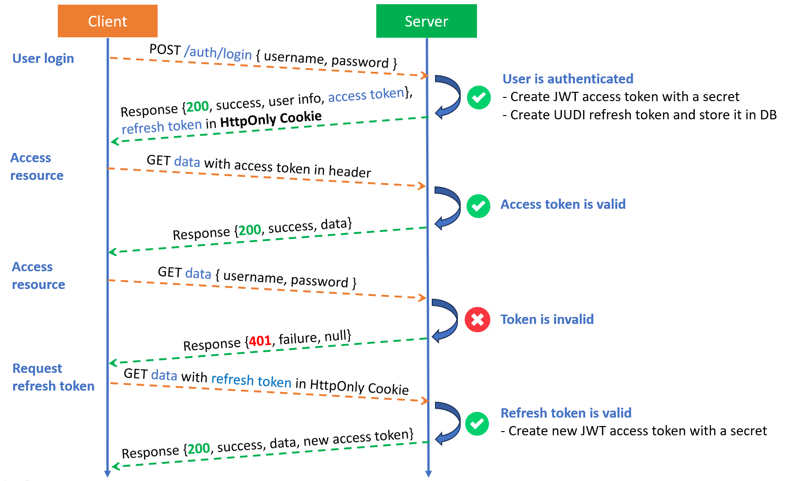
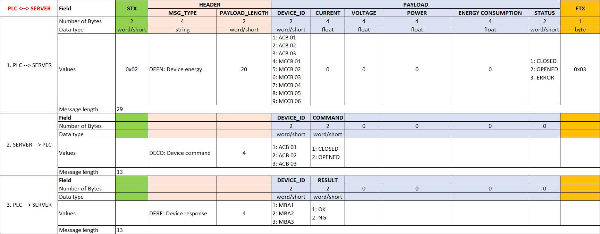
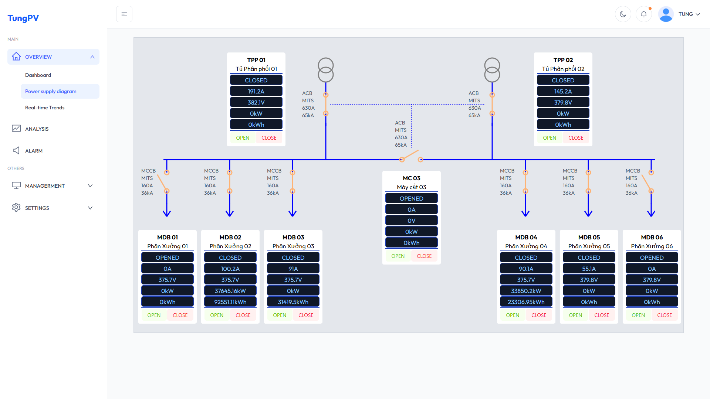
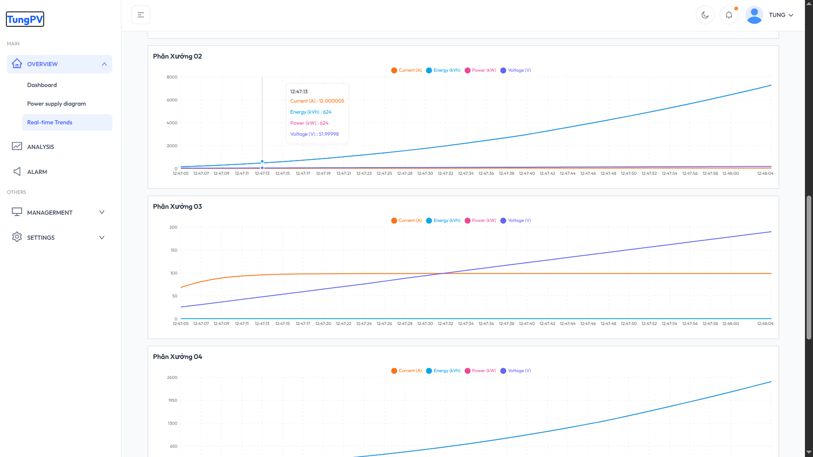
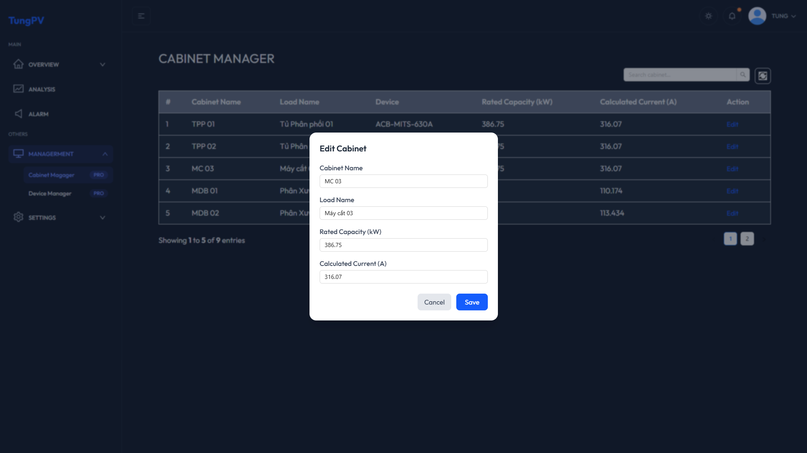

<div align="center">
 <h1>SUPERVISORY CONTROL AND DATA ACQUISITION IN POWER SYSTEM</h1>
 <h1>HỆ THỐNG ĐIỀU KHIỂN GIÁM SÁT VÀ THU THẬP DỮ LIỆU TRONG HỆ THỐNG ĐIỆN</h1>
</div>

## Content
- [Abstract](#Abstract)
- [Power Supply Design for an Industrial Plant](#designing-a-power-supply-for-an-industrial-plant)
- [Control Panel Design](#control-panel-design)
- [SCADA for Power System](#SUPERVISORY-CONTROL-AND-DATA-ACQUISITION-FOR-POWER-SYSTEM)
- [Demonstration](#demonstration)
- [Requirements](#requirements)
- [References](#references)

# ABSTRACT
<div>
 <p>This project is a modern SCADA model for the electrical system of an industrial plant. The model is developed based on the TCP/IP protocol, with the advantage of flexibility in building your own protocol and real-time communication.</p>
<p>Dự án là mô hình SCADA hiện đại cho một Xí nghiệp công nghiệp. Mô hình được phát triển dựa trên giao thức TCP/IP, với ưu điểm linh hoạt trong việc tự định nghĩa giao thức và khả năng truyền thông theo thời gian thực.</p>
</div>

# DESIGNING A POWER SUPPLY FOR AN INDUSTRIAL PLANT
<div>
 <p>Design a power supply for an industrial enterprise comprising 6 workshops, with power sourced from a 22kV connection point. Maximum power usage time Tmax = 5100 hours. Type I and Type II loads account for 75%. Allowable voltage drop in the low-voltage network ΔUcp = 5%. The calculated data is shown below.</p>
<p>Thiết kế hệ thống cấp điện cho một Xí nghiệp công nghiệp gồm 6 Phân xưởng, nguồn điện được lấy từ điểm đấu điện của lưới 22kV. Thời gian sử dụng công suất tối đa Tmax = 5100h. Phụ tải loại I, loại II chiếm 75%. Tổn hao điện áp cho phép trong mạng điện hạ thế ΔUcp = 5%. Các số liệu tính toán được thể hiện trong bảng dưới đây.</p>
<p align="center">
  
</p>
<h3>1. Calculate the selection of ACB, MCCB Table</h3>
 <table align="center">
  <thead>
    <tr>
      <th>Cabinet ID</th>
      <th>Cabinet Name</th>
      <th>Device Name</th>
      <th>Itt, A</th>
      <th>In, kA</th>
      <th>UdmCB, V</th>
      <th>IdmCB, A</th>
      <th>InCB, kA</th>
      <th>Manufacture</th>
      <th>Type</th>
      <th>Code</th>
    </tr>
  </thead>
  <tbody>
    <tr>
      <td>TPP01</td>
      <td>Tủ Phân phối 01</td>
      <td>ACB 01</td>
      <td>316.07</td>
      <td>12.72</td>
      <td>690</td>
      <td>630</td>
      <td>65</td>
      <td>MITSUBISHI</td>
      <td>NCT06</td>
      <td>AE630-SW</td>
    </tr>
    <tr>
      <td>TPP02</td>
      <td>Tủ Phân phối 02</td>
      <td>ACB 02</td>
      <td>316.07</td>
      <td>12.72</td>
      <td>690</td>
      <td>630</td>
      <td>65</td>
      <td>MITSUBISHI</td>
      <td>NCT06</td>
      <td>AE630-SW</td>
    </tr>
    <tr>
      <td>MC 03</td>
      <td>Máy Cắt 03</td>
      <td>ACB 03</td>
      <td>316.07</td>
      <td>12.72</td>
      <td>690</td>
      <td>630</td>
      <td>65</td>
      <td>MITSUBISHI</td>
      <td>NCT06</td>
      <td>AE630-SW</td>
    </tr>
    <tr>
      <td>MDB 01</td>
      <td>Tủ Phân xưởng 01</td>
      <td>MCCB 01</td>
      <td>110.17</td>
      <td>1.44</td>
      <td>690</td>
      <td>160</td>
      <td>36</td>
      <td>MITSUBISHI</td>
      <td>NF-S TYPE</td>
      <td>NF250-SV</td>
    </tr>
    <tr>
      <td>MDB 02</td>
      <td>Tủ Phân xưởng 02</td>
      <td>MCCB 02</td>
      <td>113.43</td>
      <td>1.44</td>
      <td>690</td>
      <td>160</td>
      <td>36</td>
      <td>MITSUBISHI</td>
      <td>NF-S TYPE</td>
      <td>NF250-SV</td>
    </tr>
    <tr>
      <td>MDB 03</td>
      <td>Tủ Phân xưởng 03</td>
      <td>MCCB 03</td>
      <td>103.75</td>
      <td>1.44</td>
      <td>690</td>
      <td>160</td>
      <td>36</td>
      <td>MITSUBISHI</td>
      <td>NF-S TYPE</td>
      <td>NF250-SV</td>
    </tr>
    <tr>
      <td>MDB 04</td>
      <td>Tủ Phân xưởng 04</td>
      <td>MCCB 04</td>
      <td>103.71</td>
      <td>1.44</td>
      <td>690</td>
      <td>160</td>
      <td>36</td>
      <td>MITSUBISHI</td>
      <td>NF-S TYPE</td>
      <td>NF250-SV</td>
    </tr>
    <tr>
      <td>MDB 05</td>
      <td>Tủ Phân xưởng 05</td>
      <td>MCCB 05</td>
      <td>60.74</td>
      <td>1.44</td>
      <td>690</td>
      <td>160</td>
      <td>36</td>
      <td>MITSUBISHI</td>
      <td>NF-S TYPE</td>
      <td>NF250-SV</td>
    </tr>
    <tr>
      <td>MDB 06</td>
      <td>Tủ Phân xưởng 06</td>
      <td>MCCB 06</td>
      <td>99.26</td>
      <td>1.44</td>
      <td>690</td>
      <td>160</td>
      <td>36</td>
      <td>MITSUBISHI</td>
      <td>NF-S TYPE</td>
      <td>NF250-SV</td>
    </tr>
  </tbody>
</table>
 <h3>2. Principle diagram of the distribution station</h3>
 <p>The distribution substation is designed with two 400kVA, Y/Y, 22/0.4kV transformers connected to busbars C1 and C2 and two circuit breakers (ACBs) 01 and 02. A connecting circuit breaker (ACB 03) connects two busbars. In case of a fault or when maintenance or transformer replacement is needed. One of the two Circuit breakers will trip, and Circuit breaker 03 will close to power supply on the other side.</p>
 <p>Trạm phân phối được thiết kế với 02 Máy biến áp 400kVA, Y/Y, 22/0.4kV kết nối tới 02 thanh cái C1, C2 và máy cắt ACB 01, ACB 02. Một máy cắt liên lạc ACB 03 nối giữa 2 thanh cái. Khi có sự cố hay cần bảo trì, thay thế Máy biến áp, 1 trong 2 Máy cắt ngắt điện, máy cắt 03 sẽ đóng để cấp nguồn cho các phụ tải phía bên kia.</p>
 <p align="center">
  
</p>
</div>

# CONTROL PANEL DESIGN
<div>
 <p>In this project, a PLC FX5UJ is used to control 03 main circuit breakers and to retrieve the on/off status of 03 ACBs and 06 MCCBs. The FX5 485ADP module is used to communicate with the electricity meters via the RS-485 protocol. College data of the current, voltage, power, energy consumption.</p>
 <p>Dự án sử dụng PLC FX5UJ để điều khiển 03 máy cắt chính và nhận tín hiệu trạng thái ON/OFF 03 ACB và 06 MCCB. Module truyền thông RS-485 được sử dụng để kết nối với các đồng hồ đo điện, thu thập dữ liệu năng lượng: dòng điện, điện áp, công suất tức thời, điện năng tiêu thụ.</p>
<h3>1. Control Panel Layout</h3>
 <p align="center">
  
</p>
 <h3>2. AC Power Distribution</h3>
 <p align="center">
  
</p>
  <h3>3. DC Power Distribution</h3>
 <p align="center">
  
</p>
<h3>4. Input Wiring</h3>
 <p align="center">
  
</p>
<h3>5. Output Wiring</h3>
 <p align="center">
  
</p>
 <h3>6. Terminal to CBs</h3>
 <p align="center">
  
</p>
 <h3>7. Fx5 485ADP to Metters</h3>
 <p align="center">
  
</p>
</div>

# SUPERVISORY CONTROL AND DATA ACQUISITION FOR POWER SYSTEM
<div>
  <p>A SCADA software was developed to control and monitor equipment remotely via a web browser. Energy data is collected automatically in real time. All the technologies used and communication protocols are presented below.</p>
 <p>P
  
  hần mềm SCADA được phát triển để điều khiển, giám sát trạng thái của thiết bị từ xa thông qua trình duyệt web. Dữ liệu về năng lượng được thu thập tự động theo thời gian thực. Các công nghệ sử dụng và giao thức truyền thông được mô tả bên dưới đây.</p>
<h3>1. Diagram of Technology</h3>
<p>The PLC controller communicates with the server via a TCP socket (TCP/IP). The server provides APIs and WebSockets for the users side to send and receive data.The PLC connects to field devices via RS-485 communication standard and input/output ports.</p>
 <p>Bộ điều khiển PLC giao tiếp với Server thông qua kết nối TCP/IP. Server cung cấp các API và WebSocket để User có thể gửi và nhận dữ liệu. PLC kết nối tới các thiết bị thông qua Module truyền thông RS-485 và các cổng vào ra số.</p>
<p align="center">
  
</p>

<h3>2. Technologies Used</h3>
<p>The server-side (back-end) is built on Spring Boot. The client-side (front-end) is built on ReactJS.</p>
 <p>Backend được xây dựng trên Spring Boot Framework. Frontend được xây dựng dựa trên thư viện ReactJS.</p>
<p align="center">
  
</p>

<h3>3. Table structure in Database</h3>
<p>The database management system used in the project is MySQL, which includes 7 tables:</p>
<ul>
  <li>Tables users, user_role, role: for security, authentication, and user authorization features.</li>
  <li>Table cabinet: for managing electrical cabinets: TPP, MDB.</li>
  <li>Table device: for managing devices: ACB, MCCB.</li>
  <li>Table energy: for collecting energy data.</li>
  <li>Table tokens: for storing refresh token.</li>
</ul>
<p>Hệ quản trị cơ sở dữ liệu sử dụng trong dự án là MySQL gồm 06 bảng:</p>
<ul>
  <li>Bảng users, user_role, role: cho tính năng bảo mật, xác thực và phân quyền người dùng.</li>
  <li>Bảng cabinet: quản lý tủ điện: TPP, MDB.</li>
  <li>Bảng device: quản lý thiết bị: ACB, MCCB.</li>
  <li>Bảng energy: thu thập dữ liệu về năng lượng.</li>
  <li>Bảng tokens: lưu trữ refresh token.</li>
</ul>
<p align="center">
  
</p>

<h3>4. Authentication, Authorization and Security</h3>
<p>SCADA software provides authentication features, user authorization and APIs security to protect applications from common threats such as CSRF, XSS, etc. Based on Spring Security JWT.</p>
<p>Phần mềm SCADA cung cấp các tính năng xác thực (ai là user), phân quyền (bạn được phép làm gì) và bảo mật các API để bảo vệ ứng dụng khỏi các mối đe dọa phổ biến như CSRF, XSS, etc.</p>
<p align="center">
  
</p>

<h3>5. PLC to Server Protocol</h3>
<p>A message used to transmit and receive data between a PLC and a server is defined by binary bytes. Each message sent has a start (STX) and end character (ETX).</p>
<p>Một bức điện có định dạng là các byte nhị phân dùng để truyền và nhận dữ liệu giữa PLC và Server. Mỗi bức điện gửi đi đều có kí tự bắt đầu (STX) và kí tự kết thúc (ETX).</p>
<p align="center">
  
</p>

<h3>6. Server to User Protocol</h3>
<p>The messages sent and received between the server and the user are in the format of a JSON like this.</p>
<p>Thông điệp để truyền và nhận dữ liệu giữa Server và User có định dạng là một chuỗi JSON như bên dưới.</p>

```sh
{
 "messageType": "DEEN",
 "data": {
    "deviceId": 1,
    "current": 6,
    "voltage": 380,
    "power": 2280,
    "energy": 10000,
 }
}
```

<h3>7. Power Supply Diagram</h3>
<p>The Power Supply Diagram page displays the principle diagram of the distribution substation with the parameters of the connected devices in the circuit. It displays energy data and controls for opening/closing the ACBs.</p>
<p>Trang Power Supply Diagram cung cấp sơ đồ nguyên lý của trạm phân phối và các thông số của thiết bị điện. Hiển thị giá trị năng lượng tức thời và có thể điều điều khiển AUTO/MANUAL đóng, ngắt 03 máy cắt.</p>
<p align="center">
  
</p>

<h3>8. Real-time Trend</h3>
<p>The Real-time Trend page displays an energy chart.</p>
<p>Trang Real-time Trend hiển thị biểu đồ năng lượng của các phụ tải.</p>
<p align="center">
  
</p>

<h3>9. Data Managerment</h3>
<p>This page manages electrical cabinets, equipment, and users, with features for filtering, searching, and pagination.</p>
<p>Quản lý dữ liệu về tủ điện, thiết bị và tài khoản. Cung cấp tính năng lọc, tìm kiếm dữ liệu kết hợp phân trang.</p>
<p align="center">
  
</p>

</div>

# DEMONSTRATION
<div>

<p align="center">
  <a href="https://youtu.be/s6uQ-MICRmE">
    
  </a>
</p>

<h3>MOBILE FRIENDLY</h3>
<p align="center">
  <a href="https://youtube.com/shorts/Xq4Q5umekUE?feature=share">
    
  </a>
</p>
 
</div>

# REQUIREMENTS
<div>
<p>Back-end</p>
<ul>
  <li>Spring Boot 3.5.6</li>
  <li>Tomcat server 10.1.31</li>
  <li>MySQL</li>
  <li>Spring Boot Security</li>
  <li>Spring Boot WebSocket</li>
  <li>Spring Data JPA</li>
  <li>Hibernate core 6.6.18</li>
  <li>Lombok</li>
  <li>Spring Boot Validation</li>
  <li>Json Webtoken 0.9.1</li>
</ul>
<p>Front-end</p>
<ul>
  <li>React 18.3.1</li>
  <li>Docker</li>
  <li>Axios 1.13.2</li>
  <li>React redux 9.2.0</li>
  <li>React router 7.9.6</li>
  <li>React charts 3.5.1</li>
  <li>Sockjs client 1.6.1</li>
  <li>Ant design 5.28.1</li>
  <li>Vite Tailwindcss 4.1.17</li>
</ul>
<p>PLCs</p>
<ul>
  <li>PLC FX5UJ MITSUBISHI</li>
  <li>Socket TCP programming</li>
  <li>Modbus RS-485 communication</li>
</ul>
<p>Languages: Java, JavaScript, HTML & CSS, JSX</p>

# REFERENCES
[1] Cuốn Bài tập Cung Cấp Điện - TS. Trần Quang Khánh


