

 <h1>SUPERVISORY CONTROL AND DATA ACQUISITION IN POWER SYSTEM</h1>
 <h3>ĐIỀU KHIỂN GIÁM SÁT VÀ THU THẬP DỮ LIỆU TRONG HỆ THỐNG ĐIỆN</h3>

## Contents
- [Abstract](#Abstract)
- [Power Supply Design for an Industrial Plant](#designing-a-power-supply-for-an-industrial-plant)
- [Control Panel Design](#control-panel-design)
- [SCADA for Power System](#SUPERVISORY-CONTROL-AND-DATA-ACQUISITION-FOR-POWER-SYSTEM)
- [Demonstration](#demonstration)
- [Requirements](#requirements)
- [References](#references)

# ABSTRACT

 
This project is a modern SCADA model for the electrical system of an industrial plant. The model is developed based on the TCP/IP protocol, with the advantage of flexibility in building your own protocol and real-time communication.

Dự án là mô hình SCADA hiện đại cho một Xí nghiệp công nghiệp. Mô hình được phát triển dựa trên giao thức TCP/IP, với ưu điểm linh hoạt trong việc tự định nghĩa giao thức và khả năng truyền thông theo thời gian thực.

# DESIGNING A POWER SUPPLY FOR AN INDUSTRIAL PLANT

 
Design a power supply for an industrial enterprise comprising 6 workshops, with power sourced from a 22kV connection point. Maximum power usage time Tmax = 5100 hours. Type I and Type II loads account for 75%. Allowable voltage drop in the low-voltage network ΔUcp = 5%. The calculated data is shown below.

Thiết kế hệ thống cấp điện cho một Xí nghiệp công nghiệp gồm 6 Phân xưởng, nguồn điện được lấy từ điểm đấu điện của lưới 22kV. Thời gian sử dụng công suất tối đa Tmax = 5100h. Phụ tải loại I, loại II chiếm 75%. Tổn hao điện áp cho phép trong mạng điện hạ thế ΔUcp = 5%. Các số liệu tính toán được thể hiện trong bảng dưới đây.

  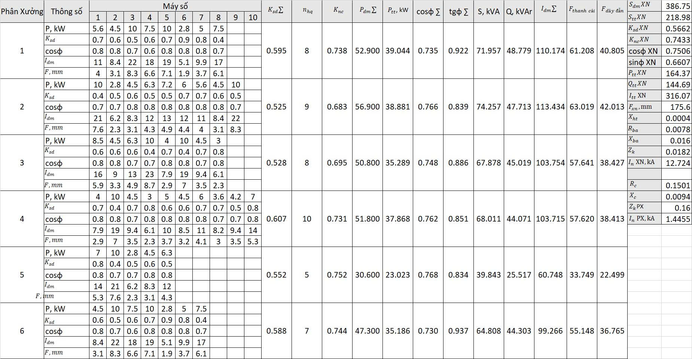

<h3>1. Calculate the selection of ACB, MCCB</h3>
 <table align="center">
  <thead>
    <tr>
      <th>Cabinet ID</th>
      <th>Cabinet Name</th>
      <th>Device Name</th>
      <th>Itt, A</th>
      <th>In, kA</th>
      <th>UdmCB, V</th>
      <th>IdmCB, A</th>
      <th>InCB, kA</th>
      <th>Manufacture</th>
      <th>Type</th>
      <th>Code</th>
    </tr>
  </thead>
  <tbody>
    <tr>
      <td>TPP01</td>
      <td>Tủ Phân phối 01</td>
      <td>ACB 01</td>
      <td>316.07</td>
      <td>12.72</td>
      <td>690</td>
      <td>630</td>
      <td>65</td>
      <td>MITSUBISHI</td>
      <td>NCT06</td>
      <td>AE630-SW</td>
    </tr>
    <tr>
      <td>TPP02</td>
      <td>Tủ Phân phối 02</td>
      <td>ACB 02</td>
      <td>316.07</td>
      <td>12.72</td>
      <td>690</td>
      <td>630</td>
      <td>65</td>
      <td>MITSUBISHI</td>
      <td>NCT06</td>
      <td>AE630-SW</td>
    </tr>
    <tr>
      <td>MC 03</td>
      <td>Máy Cắt 03</td>
      <td>ACB 03</td>
      <td>316.07</td>
      <td>12.72</td>
      <td>690</td>
      <td>630</td>
      <td>65</td>
      <td>MITSUBISHI</td>
      <td>NCT06</td>
      <td>AE630-SW</td>
    </tr>
    <tr>
      <td>MDB 01</td>
      <td>Tủ Phân xưởng 01</td>
      <td>MCCB 01</td>
      <td>110.17</td>
      <td>1.44</td>
      <td>690</td>
      <td>160</td>
      <td>36</td>
      <td>MITSUBISHI</td>
      <td>NF-S TYPE</td>
      <td>NF250-SV</td>
    </tr>
    <tr>
      <td>MDB 02</td>
      <td>Tủ Phân xưởng 02</td>
      <td>MCCB 02</td>
      <td>113.43</td>
      <td>1.44</td>
      <td>690</td>
      <td>160</td>
      <td>36</td>
      <td>MITSUBISHI</td>
      <td>NF-S TYPE</td>
      <td>NF250-SV</td>
    </tr>
    <tr>
      <td>MDB 03</td>
      <td>Tủ Phân xưởng 03</td>
      <td>MCCB 03</td>
      <td>103.75</td>
      <td>1.44</td>
      <td>690</td>
      <td>160</td>
      <td>36</td>
      <td>MITSUBISHI</td>
      <td>NF-S TYPE</td>
      <td>NF250-SV</td>
    </tr>
    <tr>
      <td>MDB 04</td>
      <td>Tủ Phân xưởng 04</td>
      <td>MCCB 04</td>
      <td>103.71</td>
      <td>1.44</td>
      <td>690</td>
      <td>160</td>
      <td>36</td>
      <td>MITSUBISHI</td>
      <td>NF-S TYPE</td>
      <td>NF250-SV</td>
    </tr>
    <tr>
      <td>MDB 05</td>
      <td>Tủ Phân xưởng 05</td>
      <td>MCCB 05</td>
      <td>60.74</td>
      <td>1.44</td>
      <td>690</td>
      <td>160</td>
      <td>36</td>
      <td>MITSUBISHI</td>
      <td>NF-S TYPE</td>
      <td>NF250-SV</td>
    </tr>
    <tr>
      <td>MDB 06</td>
      <td>Tủ Phân xưởng 06</td>
      <td>MCCB 06</td>
      <td>99.26</td>
      <td>1.44</td>
      <td>690</td>
      <td>160</td>
      <td>36</td>
      <td>MITSUBISHI</td>
      <td>NF-S TYPE</td>
      <td>NF250-SV</td>
    </tr>
  </tbody>
</table>
 <h3>2. Principle diagram of the distribution station</h3>
 
The distribution substation is designed with two 400kVA, Y/Y, 22/0.4kV transformers connected to busbars C1 and C2 via two circuit breakers (ACBs) 01 and 02. A connecting circuit breaker (ACB 03) is used to supply power to the remaining busbar in case of a fault, where one of the two circuit breakers disconnects the power.

 
Trạm phân phối được thiết kế với 02 Máy biến áp 400kVA, Y/Y, 22/0.4kV kết nối tới 02 thanh cái C1, C2 thông qua 02 máy cắt ACB 01, 02. Một máy cắt liên lạc ACB 03 được sử dụng để nối giữa 2 thanh cái. Khi có sự cố hay cần bảo trì hoặc thay thế MBA, 1 trong 2 ACB ngắt điện, máy cắt 03 sẽ đóng để cấp nguồn cho nhóm phụ tải còn lại.

 

  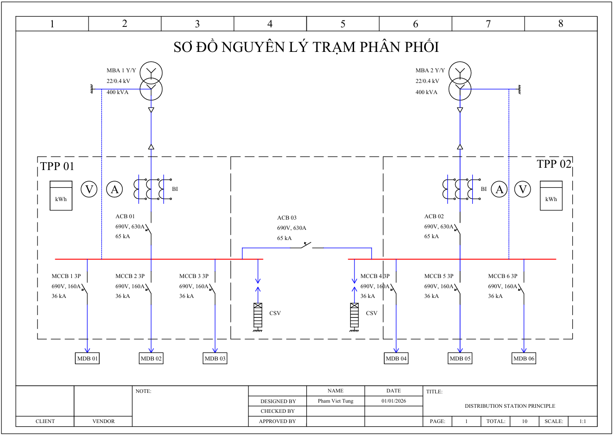

# CONTROL PANEL DESIGN

 
In this project, a PLC FX5UJ is used to control the switching on and off of 3 circuit breakers and to retrieve the on/off status of 3 ACBs and 6 MCCBs. The FX5 485ADP module is used to communicate with the electricity meters via the RS-485 protocol.

 
Dự án sử dụng PLC FX5UJ để điều khiển 03 máy cắt và nhận tín hiệu trạng thái ON/OFF của 03 ACB và 06 MCCB. Module truyền thông RS-485 được sử dụng để kết nối với các đồng hồ đo điện để lấy dữ liệu năng lượng: dòng điện, điện áp, công suất tức thời, điện năng tiêu thụ.

<h3>1. Control Panel Layout</h3>
 

  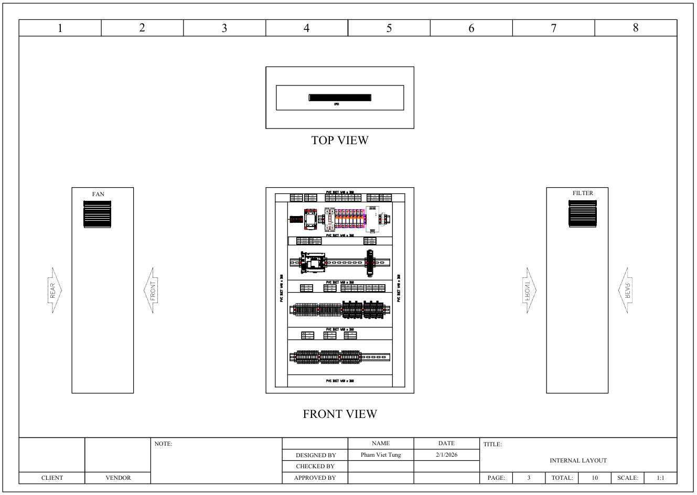

 <h3>2. AC Power Distribution</h3>
 

  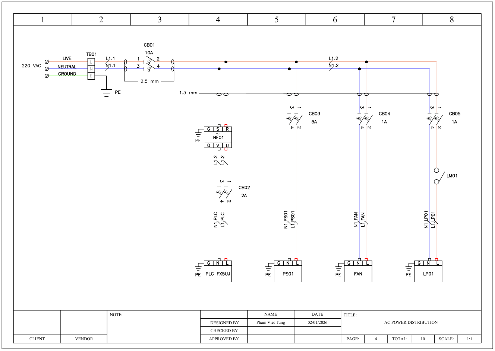

  <h3>3. DC Power Distribution</h3>
 

  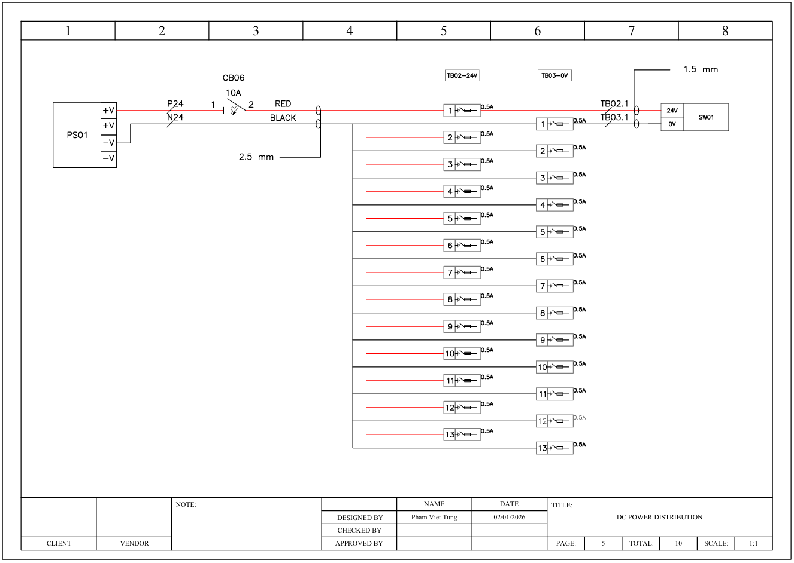

<h3>4. Input Wiring</h3>
 

  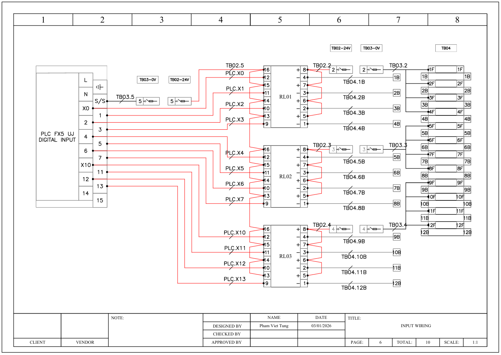

<h3>5. Output Wiring</h3>
 

  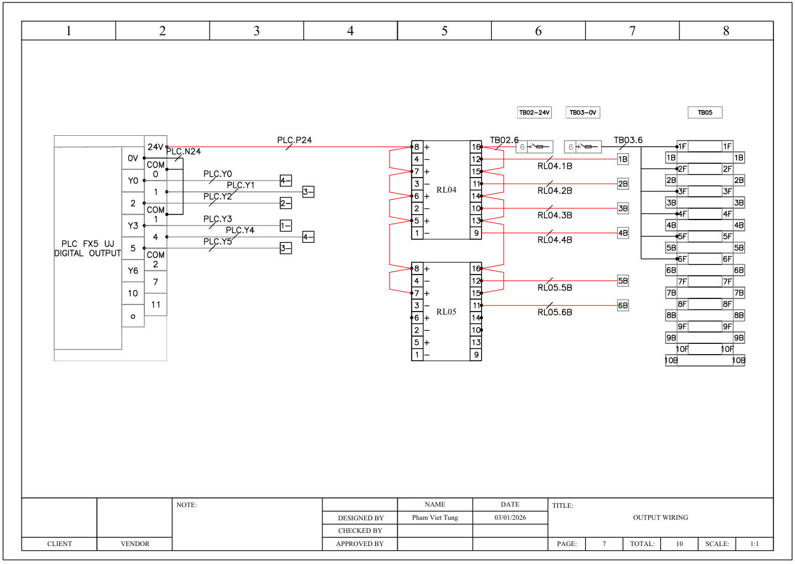

 <h3>6. Terminal to CBs</h3>
 

  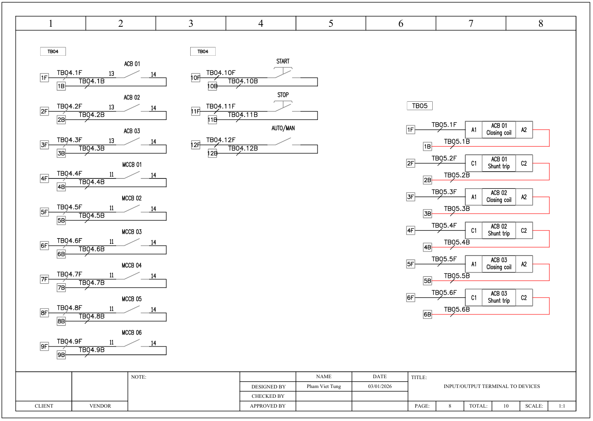

 <h3>7. Fx5 485ADP to Metters</h3>
 

  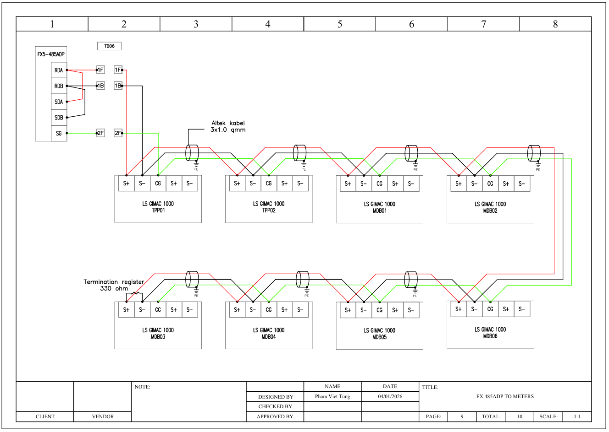

# SUPERVISORY CONTROL AND DATA ACQUISITION FOR POWER SYSTEM

  
A SCADA software was developed to control and monitor equipment remotely via a web browser. Energy data is collected automatically in real time. All the technologies used and communication protocols are presented below.

 
Một phần mềm SCADA được phát triển để điều khiển, giám sát trạng thái của thiết bị từ xa thông qua trình duyệt web. Dữ liệu về năng lượng được thu thập tự động theo thời gian thực. Các công nghệ sử dụng và giao thức truyền thông được mô tả ngay bên dưới đây.

<h3>1. Diagram of Technology</h3>

The PLC controller communicates with the server via a TCP socket (TCP/IP). The server provides APIs and WebSockets for the users side to send and receive data.The PLC connects to field devices via RS-485 communication standard and input/output ports.

 
Bộ điều khiển PLC giao tiếp với Server thông qua kết nối TCP/IP. Server cung cấp các API và WebSocket để User có thể gửi và nhận dữ liệu. PLC kết nối tới các thiết bị thông qua Module truyền thông RS-485 và các cổng vào ra số.

  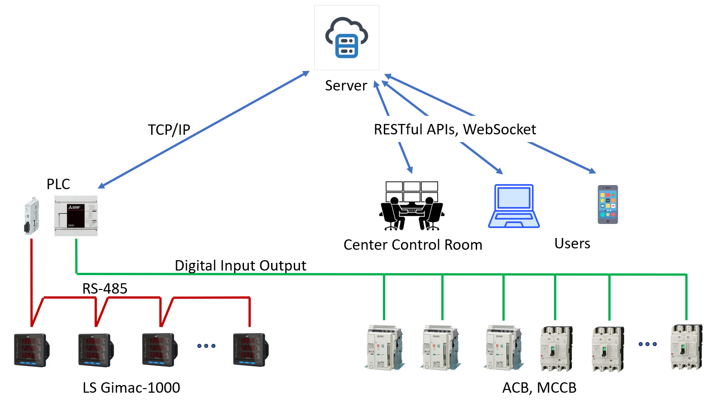

<h3>2. Technologies Used</h3>

The server-side (back-end) is built on Spring Boot. The client-side (front-end) is built on ReactJS.

 
Phía Backend (Server) được xây dựng trên Spring Boot Framework sử dụng ngôn ngữ lập trình JAVA. Bên phía Frontend (Client) được xây dựng trên thư viện ReactJS để tạo giao diện người dùng.

  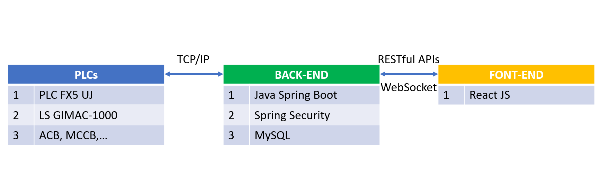

<h3>3. Authentication, Authorization and Security</h3>

SCADA software provides authentication features, user authorization and APIs security to protect applications from common threats such as CSRF, XSS, etc. Based on Spring Security JWT.

Phần mềm SCADA cung cấp các tính năng xác thực (ai là user), phân quyền (bạn được phép làm gì) và bảo mật các API để bảo vệ ứng dụng khỏi các mối đe dọa phổ biến như CSRF, XSS, etc. Mỗi request gửi lên từ Client đều xác thực JWT Token.

  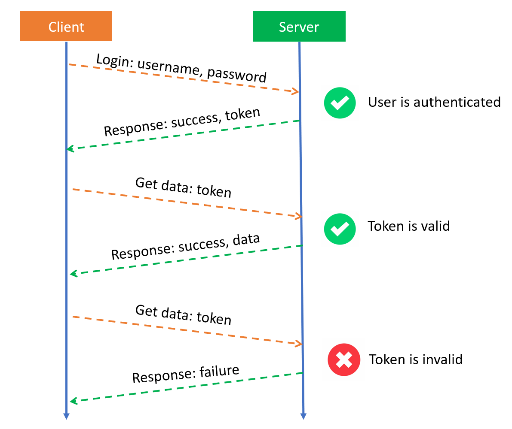

<h3>4. PLC to Server Protocol</h3>

SCADA software provides authentication features, user authorization and APIs security to protect applications from common threats such as CSRF, XSS, etc. Based on Spring Security JWT.

Phần mềm SCADA cung cấp các tính năng xác thực (ai là user), phân quyền (bạn được phép làm gì) và bảo mật các API để bảo vệ ứng dụng khỏi các mối đe dọa phổ biến như CSRF, XSS, etc. Mỗi request gửi lên từ Client đều xác thực JWT Token.

  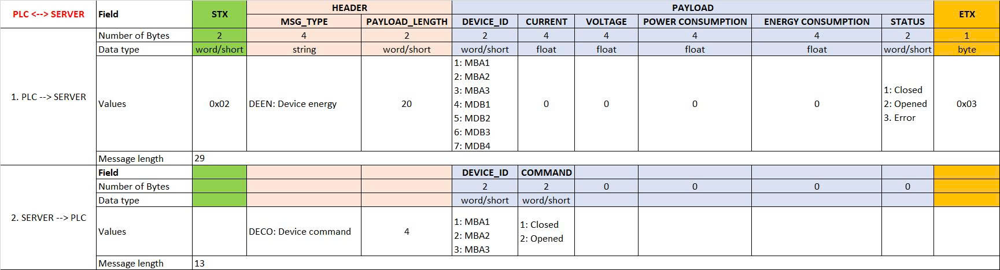

