<div align="center">
 <h1>SUPERVISORY CONTROL AND DATA ACQUISITION ON ELECTRICITY IN INDUSTRIAL PLANTS</h1>
 <h2>HỆ THỐNG ĐIỀU KHIỂN, GIÁM SÁT VÀ THU THẬP DỮ LIỆU ĐIỆN NĂNG TRONG XÍ NGHIỆP CÔNG NGHIỆP</h2>
</div>

## Contents
- [1. Abstract](#i-abstract)
- [2. Design of Uninterruptible Power Supply for an Industrial Plant](#ii-design-of-uninterruptible-power-supply-for-an-industrial-plant)
- [3. Design of Control cabinet](#iii-design-of-control-cabinet)
- [4. SCADA for Power System](#iv-supervisory-control-and-data-acquisition-for-power-system)
- [5. Hidden Markov Model and Forecast Service](#v-hidden-markov-model-and-electricity-usage-forecasting-service)
- [6. Demonstration](#vi-demonstration)
- [7. Requirements](#vii-requirements)
- [8. References](#viii-references)

# I. ABSTRACT
<div>
 <p>This project is a modern SCADA model for the electrical system of an industrial plant. The model is developed based on the TCP/IP protocol, with the advantage stability, flexibility in building your own protocol and real-time communication.</p>
<p>Dự án là mô hình SCADA hiện đại cho một Xí nghiệp công nghiệp. Mô hình được phát triển dựa trên giao thức TCP/IP, với ưu điểm ổn định, linh hoạt trong việc tự định nghĩa giao thức và khả năng truyền thông theo thời gian thực.</p>
</div>

# II. DESIGN OF UNINTERRUPTIBLE POWER SUPPLY FOR AN INDUSTRIAL PLANT
<div>
 <p>Design a power supply for an industrial enterprise comprising 6 workshops, with power sourced from a 22kV connection point. Maximum power usage time Tmax = 5100 hours. Type I and Type II loads account for 75%. The calculated data is shown below.</p>
<p>Thiết kế hệ thống cấp điện cho một Xí nghiệp công nghiệp gồm 6 Phân xưởng, nguồn điện được lấy từ điểm đấu điện của lưới 22kV. Thời gian sử dụng công suất tối đa Tmax = 5100h. Phụ tải loại I, loại II chiếm 75%. Các số liệu tính toán được thể hiện ở bên dưới.</p>
<p align="center">
  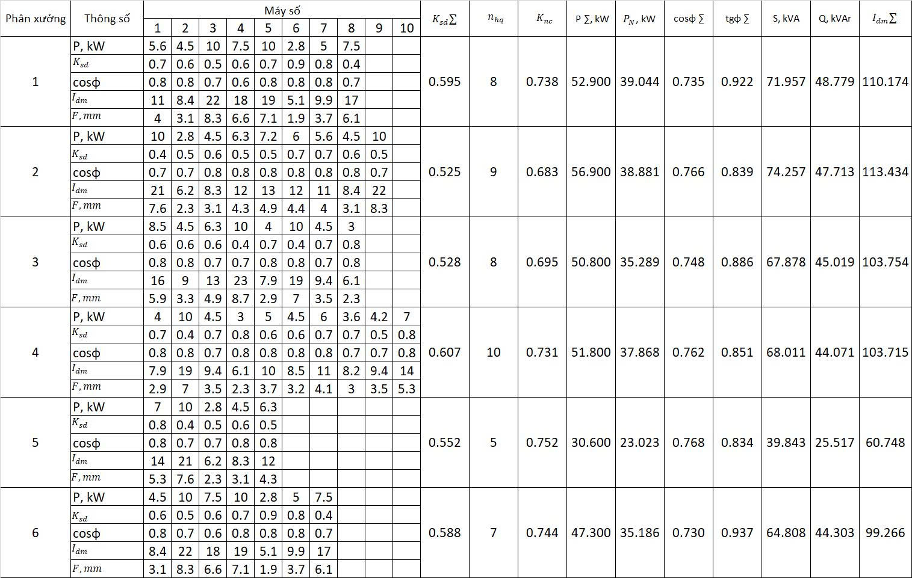
</p>

#### a. Xác định phụ tải tính toán của toàn Xí nghiệp

**- Hệ số sử dụng của toàn Xí nghiệp:**

$$
K_{sd}XN = \frac{\sum (S_i \times K_{sd,i})}{\sum S_i} = 0.566
$$

**- Hệ số nhu cầu của Xí nghiệp:**

$$
K_{nc}XN = 0.566 + \frac{(1 - 0.566)}{\sqrt(6)} = 0.743
$$

**- Hệ số công suất trung bình của toàn Xí nghiệp:**

$$
\cos \varphi XN = \frac{\sum (S_i \times \cos_{\varphi,i})}{\sum S_i} = 0.75 => \sin \varphi = \sqrt{1-\cos^2 \varphi} = 0.66
$$

**- Tổng công suất tính toán của toàn Xí nghiệp:**

$$
S_{XN} = K_{nc}XN \times \sum S_i = 0.743 \times 386.75 = 287.48 kVA
$$

$$
P_{XN} = S_{XN} \times \cos \varphi_{XN} = 0.75 \times 287.48 = 215.781 kW
$$

$$
Q_{XN} = S_{XN} \times \sin \varphi_{XN} = 0.66 \times 287.48 = 189.95 kVAr
$$

**- Chọn dây dẫn từ nguồn đến trạm biến áp:**

>>Dòng điện chạy trên dây dẫn

$$
   I = \frac{S_{XN}}{\sqrt(3) \times U} = \frac{287.48}{\sqrt(3) \times 22} = 7.544 A
$$

>>Tiết diện dây nhôm theo mật độ dòng điện kinh tế (Jkt = 1.2 A/mm2). Đối với đường dây cao áp tiết diện tối thiểu không nhỏ hơn 35mm2 => Ta chọn dây AC-35 nối từ nguồn vào trạm biến áp

$$
   F = \frac{I}{J_{kt}} = \frac{7.544}{1.2} = 6.28 \text{mm}^2
$$

#### b. Chọn máy biến áp

>>Ta có tổng công suất tính toán toàn Xí nghiệp (chưa kể đến hao tổn công suất trên đường đây) = 287.48 kVA, thời gian sử dụng công suất tối đa = 5100 h

**- Công suất trung bình**

$$
   S_{tb} = \frac{S_{XN} \times T_{max}}{8760} = \frac{287.48 \times 5100}{8760} = 167.36 kVA
$$

**- Hệ số điền kín đồ thị phụ tải = 0.58 < 0.75. Như vậy máy biến áp có thể làm việc quá tải 40% (kqt = 1.4) trong một thời gian xác định**

$$
   k_{đk} = \frac{S_{tb}}{S_{XN}} = \frac{167.63}{287.48} = 0.58
$$

=> Chọn 02 máy biến áp có công suất định mức 2 x 250 kVA, hệ số quá tải = 0.99 nhỏ hơn 1.4 => đảm bảo yêu cầu

$$
   k_{qt}= \frac{S_{XN}}{S_{nBA}} = \frac{287.48}{250} = 0.99 < 1.4
$$

**- Tham số của máy biến áp dòng THIBIDI: công suất định mức 250 kVA, điện áp ngắn mạch phần trăm Uk% = 4**

>>Tổn hao công suất không tải và tổn hao ngắn mạch (P0, Pk)

$$
   \Delta P_{0}= 0.34 kW
$$

$$
   \Delta P_{k}= 2.6 kW
$$

**- Tính toán trong máy biến áp:**

>>Dòng điện định mức của biến áp:

$$
   I_{đm}BA = \frac{S_{đm}BA}{\sqrt(3) \times U} = \frac{250}{\sqrt(3) \times 0.4} = 360.84 A
$$

>>Điện trở biến áp

$$
   R_{BA} = \frac{\Delta P_k}{3 \times I_{đm}^2} = \frac{2.6}{3 \times 360.84^2} = 0.0067 \Omega
$$

>>Tổng trở biến áp

$$
   Z_{BA} = \frac{\Delta U_k \cdot U^2}{100 * S_{BA}} = \frac{4 \cdot 0.4^2}{100 * 250} = 0.0256 \Omega
$$

>>Điện kháng biến áp

$$
   X_{BA} = \sqrt(0.0067^2 - 0.0256^2) = 0.0247 \Omega
$$

**- Tính toán ngắn mạch:**

>>Dòng điện ngắn mạch 3 pha tại thanh cái hạ áp của biến áp (N1):

$$
   I_{sc}N1= \frac{I_{đm}BA}{Uk%} = \frac{360.84}{0.04} = 9.021 kA
$$

>>Tính toán ngắn mạch cho phụ tải ở xa trạm biến áp nhất (Phân xưởng 01, điểm N2): dây đồng 35mm2, chiều dài 160m, điện trở suất dây đồng = 0.0178, điện kháng Xd = 0.00008

$$
   R_{tổng} = R_{BA} + \rho \times \frac{l}{35} = 0.0067 + 0.0813 = 0.088 \Omega
$$

$$
   X_{tổng} = X_{BA} + Xd \times l = 0.0247 + 0.00008 \times 160 = 0.0357 \Omega
$$

$$
   Z_{tổng} = \sqrt((0.088)^2 + (0.0357)^2) = 0.094 \Omega
$$

>>Dòng điện ngắn mạch 3 pha tại điểm N2:

$$
   I_{sc}N2 = \frac{U}{\sqrt(3) \times Z_{tổng}} = \frac{400}{\sqrt(3) \times 0.094} = 2.45 kA
$$

#### c. Chọn thanh cái hạ áp của trạm biến áp

**- Dòng điện chạy qua thanh cái**

$$
   I = \frac{S_{XN}}{\sqrt(3) \times U} = \frac{287.47}{\sqrt(3) \times 0.4} = 414.93 A
$$

>>Chọn thanh cái dẹt bằng đồng có Jkt = 1.8 A/mm2, kích thước 50x6 = 300 mm2

$$
   F = \frac{I}{J_{kt}} = \frac{414.93}{1.8} = 230.51 \text{mm}^2
$$

<h3>1. Selecting MCCB and ACB</h3>
 <table align="center">
  <thead>
    <tr>
      <th>Cabinet ID</th>
      <th>Cabinet Name</th>
      <th>Device Name</th>
      <th>Itt, A</th>
      <th>In, kA</th>
      <th>UdmCB, V</th>
      <th>IdmCB, A</th>
      <th>InCB, kA</th>
      <th>Manufacture</th>
      <th>Type</th>
      <th>Code</th>
    </tr>
  </thead>
  <tbody>
    <tr>
      <td>TPP01</td>
      <td>Tủ Phân phối 01</td>
      <td>ACB 01</td>
      <td>414.93</td>
      <td>9.021</td>
      <td>690</td>
      <td>630</td>
      <td>65</td>
      <td>MITSUBISHI</td>
      <td>NCT06</td>
      <td>AE630-SW</td>
    </tr>
    <tr>
      <td>TPP02</td>
      <td>Tủ Phân phối 02</td>
      <td>ACB 02</td>
      <td>414.93</td>
      <td>9.021</td>
      <td>690</td>
      <td>630</td>
      <td>65</td>
      <td>MITSUBISHI</td>
      <td>NCT06</td>
      <td>AE630-SW</td>
    </tr>
    <tr>
      <td>MC 03</td>
      <td>Máy Cắt 03</td>
      <td>ACB 03</td>
      <td>414.93</td>
      <td>9.021</td>
      <td>690</td>
      <td>630</td>
      <td>65</td>
      <td>MITSUBISHI</td>
      <td>NCT06</td>
      <td>AE630-SW</td>
    </tr>
    <tr>
      <td>MDB 01</td>
      <td>Tủ Phân xưởng 01</td>
      <td>MCCB 01</td>
      <td>110.17</td>
      <td>2.45</td>
      <td>690</td>
      <td>160</td>
      <td>36</td>
      <td>MITSUBISHI</td>
      <td>NF-S TYPE</td>
      <td>NF250-SV</td>
    </tr>
    <tr>
      <td>MDB 02</td>
      <td>Tủ Phân xưởng 02</td>
      <td>MCCB 02</td>
      <td>113.43</td>
      <td>2.45</td>
      <td>690</td>
      <td>160</td>
      <td>36</td>
      <td>MITSUBISHI</td>
      <td>NF-S TYPE</td>
      <td>NF250-SV</td>
    </tr>
    <tr>
      <td>MDB 03</td>
      <td>Tủ Phân xưởng 03</td>
      <td>MCCB 03</td>
      <td>103.75</td>
      <td>2.45</td>
      <td>690</td>
      <td>160</td>
      <td>36</td>
      <td>MITSUBISHI</td>
      <td>NF-S TYPE</td>
      <td>NF250-SV</td>
    </tr>
    <tr>
      <td>MDB 04</td>
      <td>Tủ Phân xưởng 04</td>
      <td>MCCB 04</td>
      <td>103.71</td>
      <td>2.45</td>
      <td>690</td>
      <td>160</td>
      <td>36</td>
      <td>MITSUBISHI</td>
      <td>NF-S TYPE</td>
      <td>NF250-SV</td>
    </tr>
    <tr>
      <td>MDB 05</td>
      <td>Tủ Phân xưởng 05</td>
      <td>MCCB 05</td>
      <td>60.74</td>
      <td>2.45</td>
      <td>690</td>
      <td>160</td>
      <td>36</td>
      <td>MITSUBISHI</td>
      <td>NF-S TYPE</td>
      <td>NF250-SV</td>
    </tr>
    <tr>
      <td>MDB 06</td>
      <td>Tủ Phân xưởng 06</td>
      <td>MCCB 06</td>
      <td>99.26</td>
      <td>2.45</td>
      <td>690</td>
      <td>160</td>
      <td>36</td>
      <td>MITSUBISHI</td>
      <td>NF-S TYPE</td>
      <td>NF250-SV</td>
    </tr>
  </tbody>
</table>
 <h3>2. Principle diagram of the distribution station</h3>
 <p>The distribution substation is designed with two 250 kVA, Y/Y, 22/0.4kV transformers connected to busbars C1 and C2 of size 50x6 mm2. The conductors from the power source to the substation are AC-35 aluminum wires.. A connecting circuit breaker (ACB 03) connects two busbars. In case of a fault or when maintenance or transformer replacement is needed. One of the two Circuit breakers will trip, and Circuit breaker 03 will close to power supply on the other side.</p>
 <p>Trạm phân phối được thiết kế với 02 máy biến áp 250 kVA, Y/Y, 22/0.4kV kết nối tới 02 thanh cái C1 và C2 kích thước 50x6 mm2, dây dẫn từ nguồn tới trạm biến áp là dây nhôm AC-35. Một máy cắt liên lạc ACB 03 nối giữa 2 thanh cái. Khi có sự cố hay cần bảo trì, thay thế máy biến áp, 1 trong 2 máy cắt ngắt điện, máy cắt 03 sẽ đóng để cấp nguồn cho các phụ tải phía bên kia.</p>
 <p align="center">
  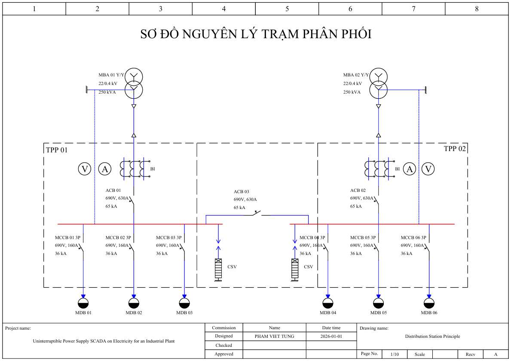
</p>
</div>

# III. DESIGN OF CONTROL CABINET
<div>
 <p>In this project, a PLC FX5UJ is used to control 03 main circuit breakers. Retrieve the on/off status of 03 ACBs and 06 MCCBs. The FX5-485ADP module is used to communicate with the electricity meters via the RS-485 protocol. College data of the current, voltage, power, energy consumption.</p>
 <p>Dự án sử dụng PLC FX5UJ để điều khiển 03 máy cắt chính. Nhận tín hiệu trạng thái ON/OFF của 03 ACB và 06 MCCB. Module truyền thông FX5-485ADP được sử dụng để kết nối với các đồng hồ đo điện, thu thập dữ liệu năng lượng: dòng điện, điện áp, công suất tức thời, điện năng tiêu thụ.</p>
<h3>1. Control cabinet layout</h3>
 <p align="center">
  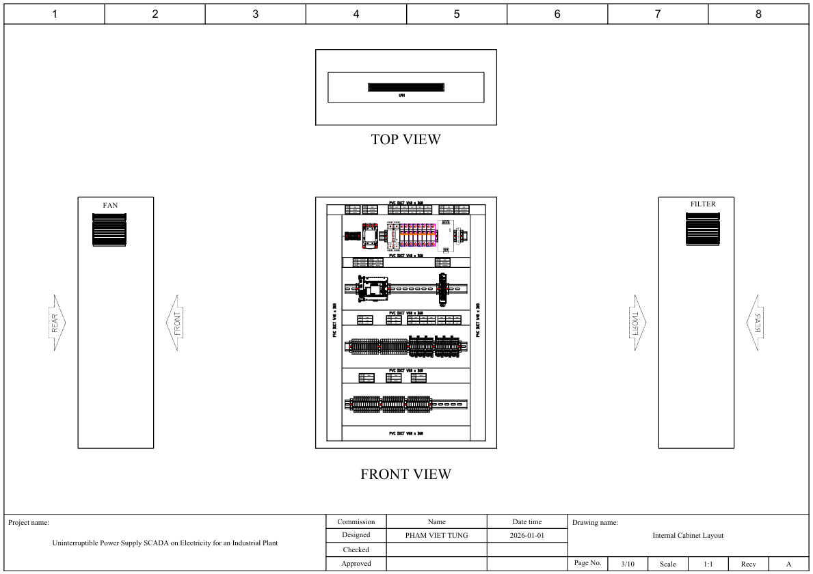
</p>
 <h3>2. AC Power Distribution</h3>
 <p align="center">
  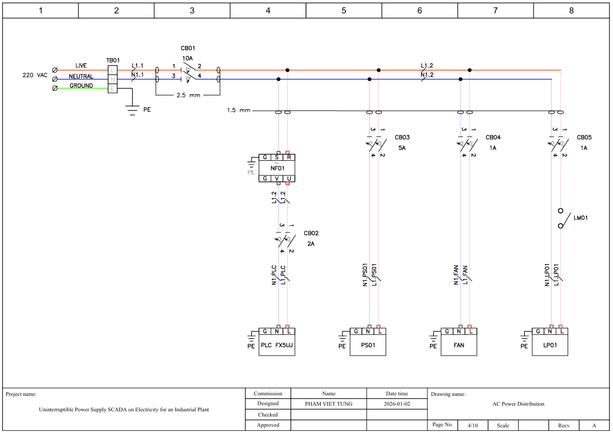
</p>
  <h3>3. DC Power Distribution</h3>
 <p align="center">
  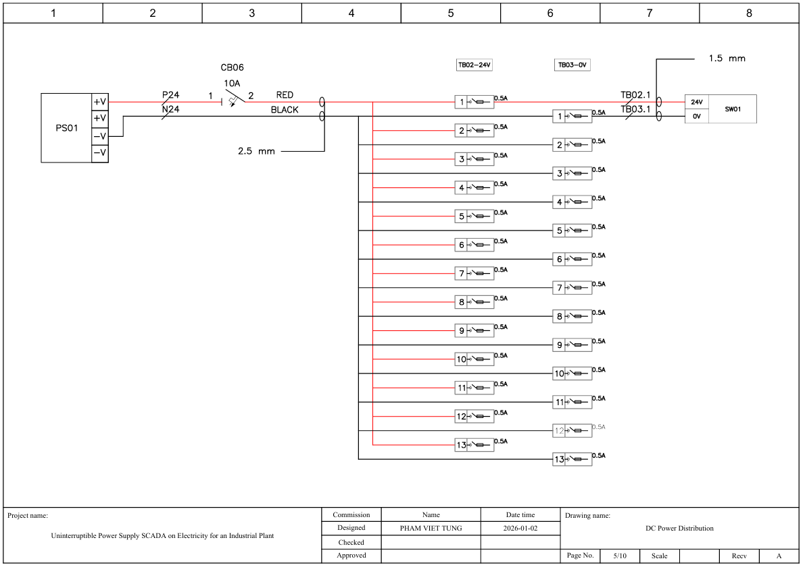
</p>
<h3>4. Input wiring</h3>
 <p align="center">
  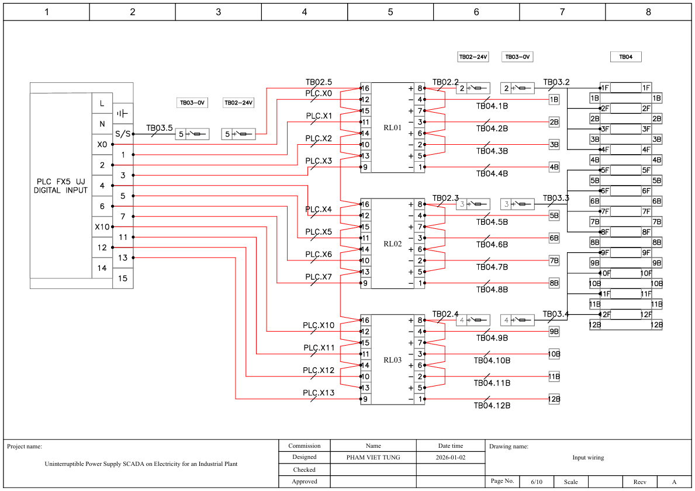
</p>
<h3>5. Output wiring</h3>
 <p align="center">
  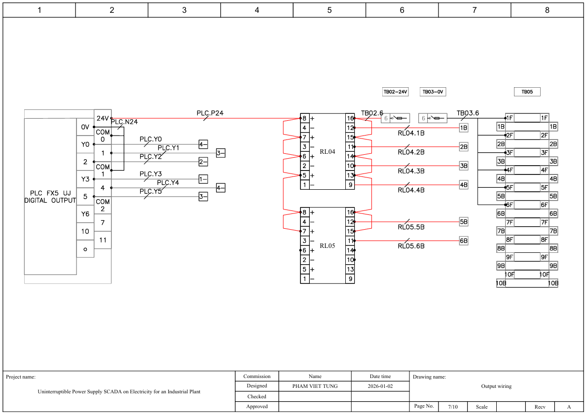
</p>
 <h3>6. Terminal to ACBs and MCCBs</h3>
 <p align="center">
  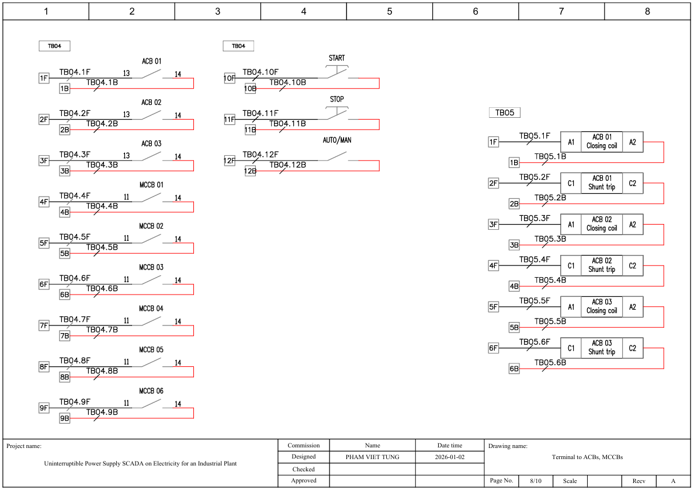
</p>
 <h3>7. Fx5-485ADP to the electrical meters</h3>
 <p align="center">
  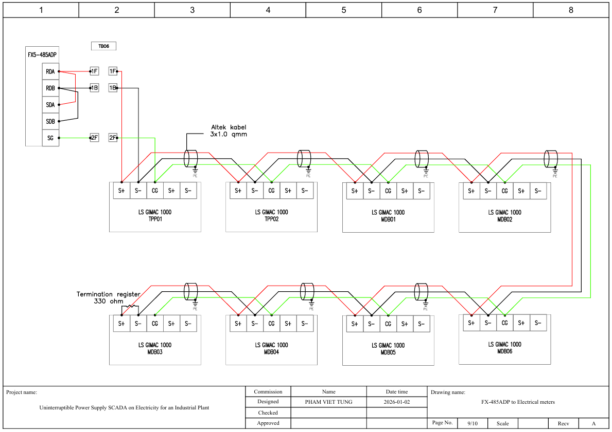
</p>
</div>

# IV. SUPERVISORY CONTROL AND DATA ACQUISITION FOR POWER SYSTEM
<div>
  <p>The SCADA software used to control and monitor equipment remotely via a Web browser. Energy data is collected automatically in real time. All the technologies used and communication protocols are presented below.</p>
 <p>Phần mềm SCADA sử dụng để điều khiển, giám sát trạng thái của thiết bị từ xa trên trình duyệt Web. Dữ liệu về năng lượng được thu thập tự động theo thời gian thực. Các công nghệ sử dụng và giao thức truyền thông được mô tả bên dưới đây.</p>
 
<h3>1. Diagram and Technologies used</h3>
<p>The PLC controller communicates with the server via a TCP socket (TCP/IP). The server provides APIs and WebSockets for the users side to send and receive data.The PLC connects to field devices via RS-485 communication standard and input/output ports.</p>
 <p>Bộ điều khiển PLC truyền thông với Server thông qua kết nối TCP/IP. Server cung cấp các API và WebSocket để User có thể gửi và nhận dữ liệu. PLC kết nối tới các thiết bị ở hiện trường thông qua chuẩn truyền thông Modbus RS-485 và các cổng vào/ra số.</p>
<p align="center">
  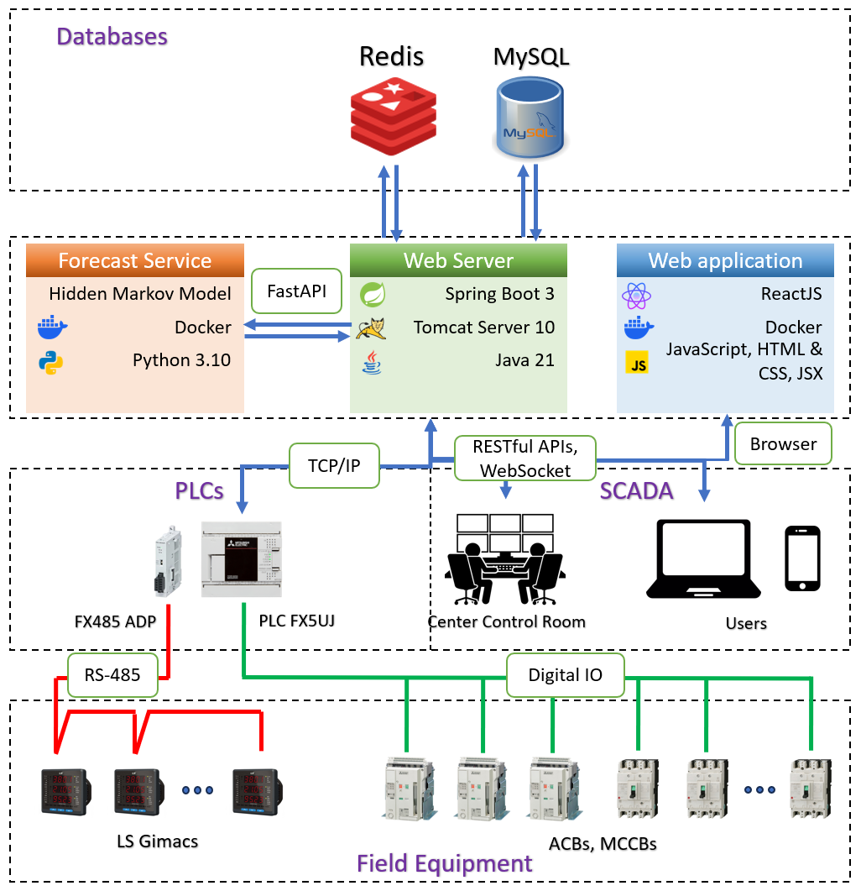
</p>
<p>The server-side (back-end) is built on Spring Boot Framework. The client-side (front-end) is built on ReactJS. This project also uses the MySQL and Redis database management system - resulting in fast query speeds and enhance the requests from Client.</p>
 <p>Phía Back-end được xây dựng trên nền tảng Spring Boot và Front-end được xây dựng dựa trên thư viện ReactJS. Dự án cũng sử dụng hệ quản trị cơ sở dữ liệu MySQL và Redis - cho tốc độ truy vấn nhanh và tăng hiệu suất xử lý các request từ Client.</p>

<h3>2. Table structure in Database</h3>
<p>The database management system used in the project is MySQL, which includes 10 tables:</p>
<ul>
  <li>Tables users, user_role, role: for security, authentication, and user authorization features.</li>
  <li>Table cabinet: for managing electrical cabinets (TPP, MDB).</li>
  <li>Table device: for managing devices (ACB, MCCB).</li>
  <li>Table energy: for collecting energy data.</li>
  <li>Table tokens: for storing refresh token.</li>
  <li>Table alarm, alarm_type, alarm_history: for alarm feature.</li>
</ul>
<p>Hệ quản trị cơ sở dữ liệu sử dụng trong dự án là MySQL gồm 10 bảng:</p>
<ul>
  <li>Bảng users, user_role, role: cho tính năng bảo mật, xác thực và phân quyền người dùng.</li>
  <li>Bảng cabinet: quản lý tủ điện (TPP, MDB).</li>
  <li>Bảng device: quản lý thiết bị (ACB, MCCB).</li>
  <li>Bảng energy: thu thập dữ liệu về năng lượng.</li>
  <li>Bảng tokens: lưu trữ refresh token.</li>
  <li>Bảng alarm, alarm_type, alarm_history: cho tính năng cảnh báo.</li>
</ul>
<p align="center">
  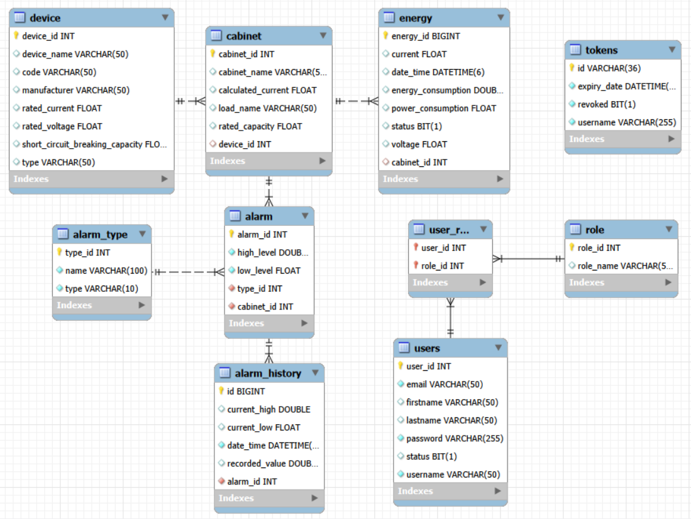
</p>

<h3>3. Authentication, Authorization and Security (Spring Security JWT)</h3>
<p>SCADA software provides authentication features, user authorization and APIs security to protect applications from common threats such as CSRF, XSS, etc.</p>
<p>Phần mềm SCADA cung cấp các tính năng xác thực (ai là user), phân quyền (bạn được phép làm gì) và bảo mật các API để bảo vệ ứng dụng khỏi các mối đe dọa phổ biến như CSRF, XSS, etc. </p>
<p align="center">
  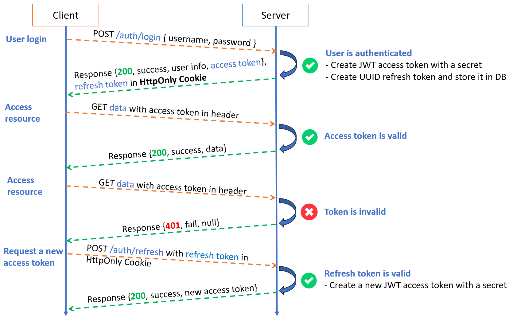
</p>

<h3>4. PLC-Server Protocol</h3>
<p>A message used to transmit and receive data between a PLC and a server is defined by a byte array. Each message sent has a start (STX) and end character (ETX).</p>
<p>Một bức điện có định dạng là mảng các byte dùng để truyền và nhận dữ liệu giữa PLC và Server. Mỗi bức điện gửi đi đều có kí tự bắt đầu (STX) và kí tự kết thúc (ETX).</p>
<p align="center">
  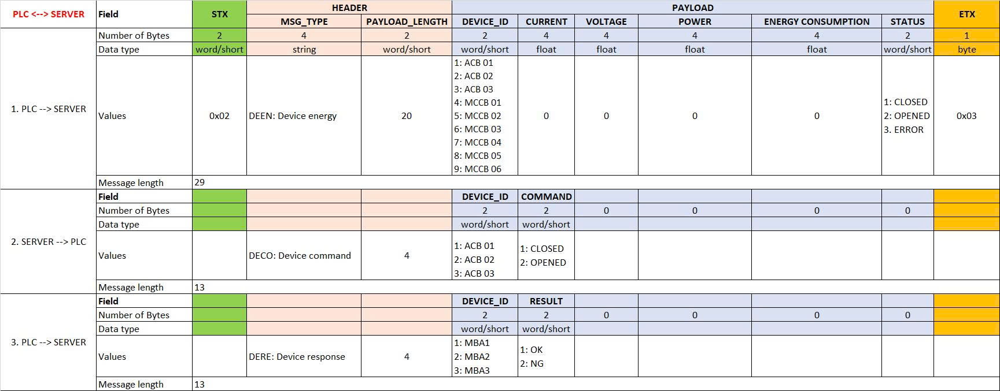
</p>

<h3>5. Server-User Protocol</h3>
<p>The messages sent and received between the server and the user are in the format of a JSON like this.</p>
<p>Thông điệp để truyền và nhận dữ liệu giữa Server và User có định dạng là một chuỗi JSON như bên dưới.</p>

```sh
{
 "messageType": "DEEN",
 "data": {
    "deviceId": 1,
    "current": 6,
    "voltage": 380,
    "power": 2280,
    "energy": 10000,
 }
}
```
<h3>6. Dashboard</h3>
<p>The Dashboard page displays a monthly energy consumption breakdown for the year, yesterday's and today's energy usage, and the electricity bill amount.</p>
<p>Trang Dashboard hiển thị bảng thống kê điện năng hàng tháng trong năm, mức tiêu thụ điện năng ngày hôm qua và trong ngày hôm nay, cùng với số tiền điện phải chi trả. Giao diện SCADA còn cho phép cài đặt chế độ hiển thị sáng/tối, chọn ngôn ngữ hiển thị Tiếng Việt/Tiếng Anh.</p>
<p align="center">
  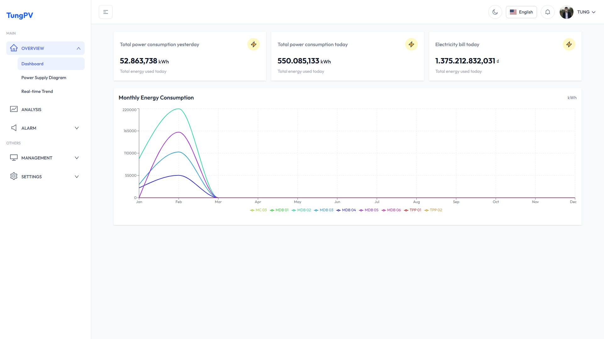
</p>

<h3>7. Power Supply Diagram</h3>
<p>The Power Supply Diagram page displays the principle diagram of the distribution substation with the parameters of the connected devices in the circuit. It displays energy data and controls for opening/closing the ACBs.</p>
<p>Trang Power Supply Diagram cung cấp sơ đồ nguyên lý của trạm phân phối và các thông số của thiết bị điện. Hiển thị giá trị năng lượng tức thời và có thể điều điều khiển AUTO/MANUAL đóng, ngắt 03 máy cắt.</p>
<p align="center">
  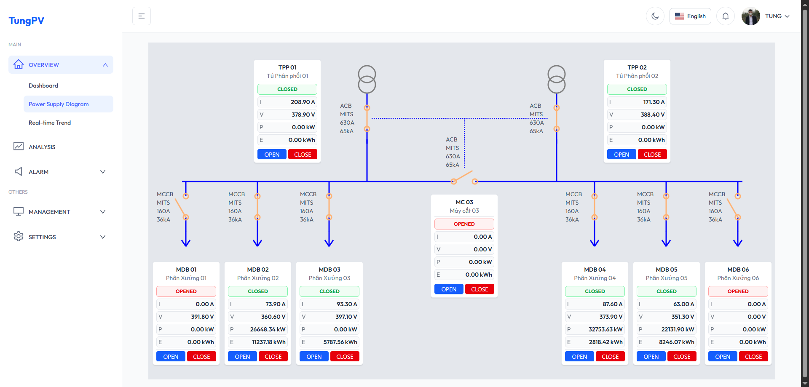
</p>

<h3>8. Real-time Trend</h3>
<p>The Real-time Trend page displays energy graphs of loads: instantaneous current, instantaneous voltage, power consumption, and energy consumption over time.</p>
<p>Trang Real-time Trend hiển thị biểu đồ năng lượng của từng Phân xưởng: Dòng điện tức thời, điện áp tức thời, công suất tiêu thụ và điện năng tiêu thụ theo thời gian thực.</p>
<p align="center">
  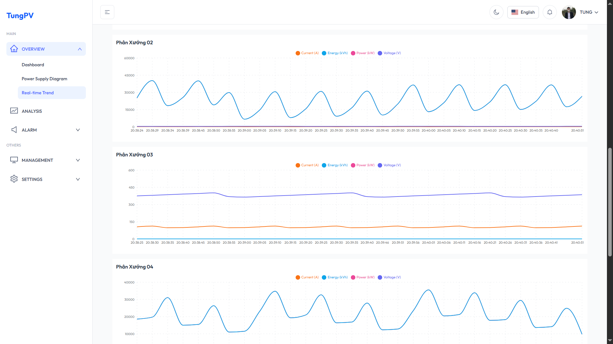
</p>

<h3>9. Analysis</h3>
<p>The Analysis page provides a chart showing the daily energy consumption statistics for each load.</p>
<p>Trang Analysis cung cấp biểu đồ thống kê năng lượng tiêu thụ của từng Phân xưởng theo ngày.</p>
<p align="center">
  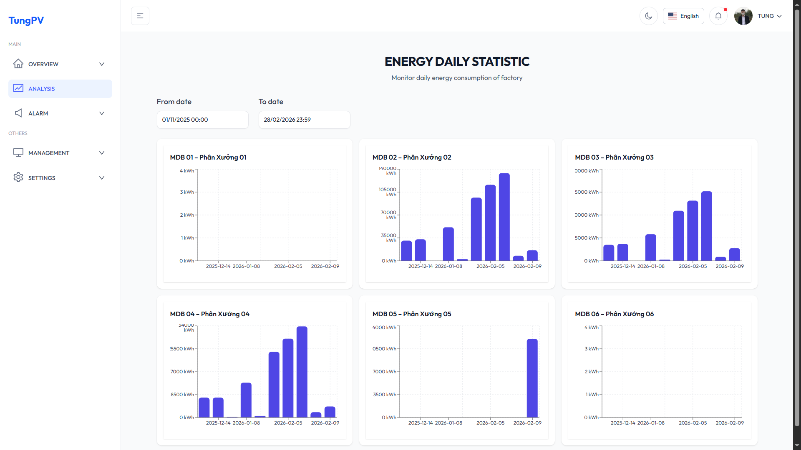
</p>

<h3>10. Alarm</h3>
<p>The Alarm page allows users to set alarm thresholds for daily electricity usage. Specifically:</p>
<ul>
  <li>[A] amount of electricity used up to this point.</li>
  <li>[A0]amount of electricity used yesterday.</li>
  <li>Accumulated electricity during the day = A - A0.</li>
</ul>
<p>Trang Alarm cho phép người dùng cài đặt ngưỡng cảnh báo về mức sử dụng điện năng trong ngày. Trong đó:</p>
<ul>
  <li>[A] số điện năng đã tiêu thụ tính đến thời điểm hiện tại.</li>
  <li>[A0]số điện năng đã tiêu thụ ngày hôm qua.</li>
  <li>Điện năng tích lũy trong ngày = A - A0.</li>
</ul>
<p align="center">
  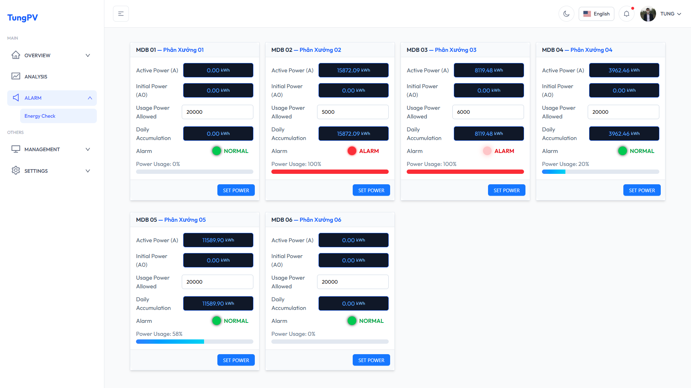
</p>

<h3>11. Management</h3>
<p>Manages data on the installed capacity of each load, parameters of selected ACBs and MCCBs, account settings, along with search functionality combined with pagination.</p>
<p>Quản lý dữ liệu về công suất đặt của từng Phân xưởng, thông số của ACB, MCCB đã chọn, cài đặt tài khoản, cùng với chức năng tìm kiếm kết hợp phân trang.</p>
<p align="center">
  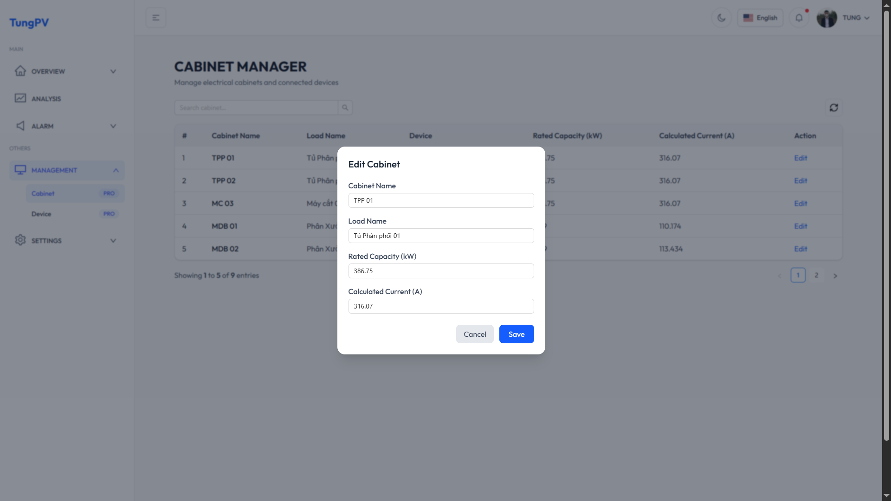
</p>

</div>

# V. HIDDEN MARKOV MODEL AND ELECTRICITY USAGE FORECASTING SERVICE

<h3>1. Hidden Markov Model</h3>
<p>The Markov Model is a probabilistic model used to decrible the state of a system, where the future states depend only on the present, not on the past. Consider
a sequence of state variables q1, q2, ..., qi. Markov assumption: </p>

$$
P_{(q_i = \alpha | q_1, q_2, ..., q_i)} = P_{(q_i = \alpha | q_{i - 1})}
$$

<p>Components of the Markov Model: </p>
<p>- System states </p>

$$
S = \{ S_1, S_2, ..., S_n \}
$$

<p>- Initial probability distribution </p>

$$
\pi = \{ \pi_1, \pi_2, ..., \pi_n \}
$$

<p>- Transition probability matrix </p>

$$
P = \begin{bmatrix}
P_{11} & P_{12} & ... & P_{1n} \\
P_{21} & P_{22} & ... & P_{2n} \\
... & ... & ... & ... \\
P_{n1} & P_{n2} & ... & P_{nn} \\
\end{bmatrix}
$$

<p>And </p>

$$
\sum_{j=1}^{n} P_{ij} = 1
$$

<p>A Markov chain is useful when we need to compute a probability for a sequence
of observable events. In many cases, however, the events we are interested in are
hidden: we don’t observe them directly.</p>
<p>For example we don’t normally observe states in a UPS System. Rather, we see power comsumed, and must infer the states from the
state sequence. We call the states hidden because they are not observed.</p>

<p>Example of a Markov chain</p>

$$
O = \{ 1kWh, 2kWh, 2kWh, 3kWh,... \}
$$ 

<p>Infer the states then</p>

$$
S = \{ 1, 2, 2, 3,... \}
$$

<p>Hidden Markov models be featured by three fundamental problems:</p>
<ul>
  <li>Problem 1 (Likelihood): Given an HMM λ = (A,B) and an observation sequence O, determine the likelihood P(O|λ)</li>
  <li>Problem 2 (Decoding): Given as input an HMM λ = (A,B) and a sequence of observations O = o1,o2,...,oT , find the most probable sequence of states Q = q1q2q3...qT.</li>
  <li>Problem 3 (Training): Given an observation sequence O and the set of possible states in the HMM, learn the HMM parameters A and B.</li>
</ul>


<h3>2. Electricity usage forecasting service</h3>
<p>a. Dataset</p>

<p> We don't have enough data to train the model, so let reference dataset of UCI Machine Learning for model training. Please, refer to: https://www.kaggle.com/datasets/uciml/electric-power-consumption-data-set</p>
<p>This project selected 03 electrical parameters for training the model, that is: Global active power, Voltage, Global intensity</p>
<p>Vì không đủ dữ liệu để huấn luyện mô hình nên dự án tham khảo tập dữ liệu của UCI ML: https://www.kaggle.com/datasets/uciml/electric-power-consumption-data-set</p>
<p>Dự án chọn 03 thông số điện để huấn luyện mô hình: Công suất tiêu thụ, điện áp, dòng điện của toàn Xí nghiệp mỗi giờ</p>
<p>b. The system consists of 03 states</p>
<ul>
  <li>S1 - LOWLOAD</li>
  <li>S2 - NORMAL</li>
  <li>S3 - WARNING</li>
  <li>S4 - OVERLOAD</li>
</ul>

<p>c. Initial probability distribution</p>

$$
\pi = \{ 0, 1, 0, 0 \}
$$

<p>d. Transition probability matrix</p>

$$
P = \begin{bmatrix}
0.76102974 & 0.01277457 & 0.21681042 & 0.00938528 \\
0.00495119 & 0.67550022 & 0.11157301 & 0.20797559 \\
0.26248165 & 0.09087763 & 0.48913395 & 0.15750676 \\
0.029213   & 0.08783518 & 0.21200698 & 0.67094483 \\
\end{bmatrix}
$$

<p>The transition probability matrix is ​​a graph where each state is represented by a vertex. The transition probability is expressed for each arc with two vertices.</p>
<p>Assuming the power system is currently in state S2 (NORMAL), the predicted probability of the next state being S1 (LOWLOAD) is approximately 0.49%, remaining in S2 is 67.55%, S3 (WARNING) is 11.15%, and S4 (OVERLOAD) is 20.79%.</p>
<p>Ma trận chuyển trạng thái là một đồ thị mà mỗi trạng thái là một đỉnh của đồ thị và xác suất chuyển trạng thái là trọng số giữa 2 đỉnh.</p>
<p>Giả sử hệ thống điện đang ở trạng thái S2 (NORMAL). Trạng thái tiếp theo, xác suất để hệ thống chuyển sang S1 (LOWLOAD) là khoảng 0,49%, ở lại S2 là 67,55%, S3 (WARNING) là 11,15%, S4 (OVERLOAD) là 20,79%</p>
<p align="center">
  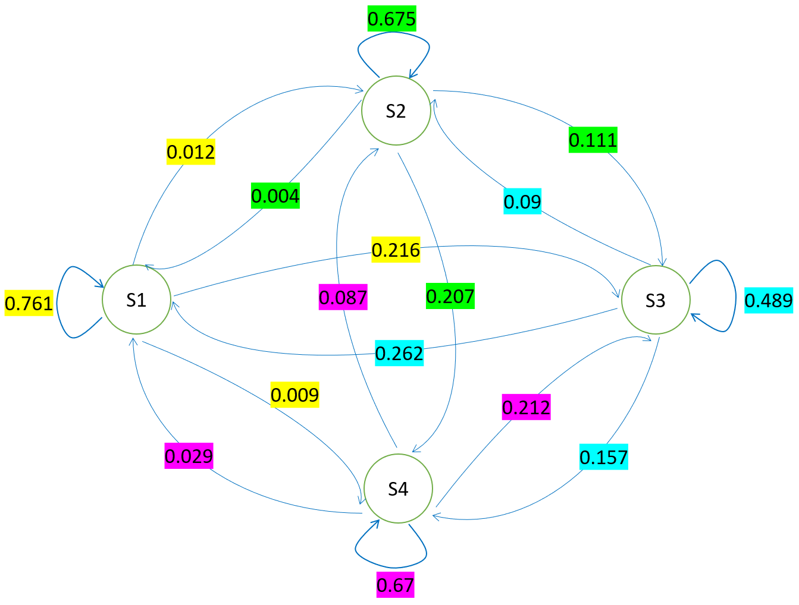
</p>

<p>e. Analysis the electricity usage on 15 February 2026</p>
<p>* Predict hidden states & Anomaly delection</p>
<p>Looking at the state chart for 15 February 2026, it shows that the power system operates at a normal level during the night and morning hours (0h - 8h). The peak electricity consumption periods are from around noon (11h - 16h) and evening (18h - 22h). After 22h, electricity consumption is low, indicating a day-night cycle within the system.</p>
<p>Nhìn vào biểu đồ trạng thái ngày 15-02-2026 cho thấy thời điểm từ đêm và sáng (0h - 8h) hệ thống điện hoạt động ở mức bình thường, từ khoảng trưa (11h - 16h) và chiều tối (18h - 22h) là khoảng thời gian cao điểm sử dụng điện. Sau 22h đêm là mức tiêu thụ điện thấp, cho thấy hệ thống có chu kì ngày và đêm.</p>
<p align="center">
  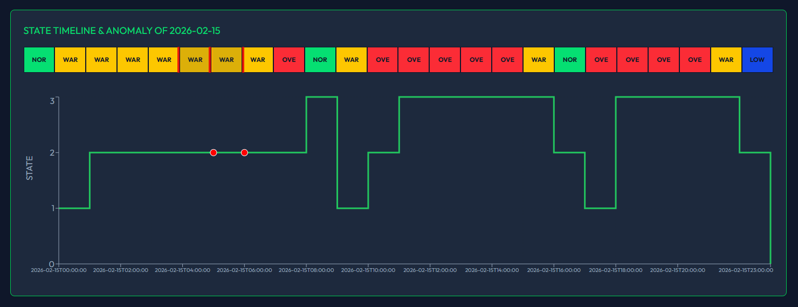
</p>

<p>* Forecast of energy consumption for the next 24 hours (16 February 2026)</p>
<p>The model provides a forecast of electricity consumption over the next 24 hours. Looking at the graph, the trend is relatively flat, with an average electricity consumption of approximately 1.5 kW per hour.</p>
<p>Mô hình đưa ra dự báo về mức tiêu thụ điện năng trong 24h tiếp theo, nhìn vào biểu đồ cho thấy đồ thị tương đối phẳng, mức tiêu thụ điện năng ở mức thấp khoảng 1.5 kW mỗi giờ.</p>
<p align="center">
  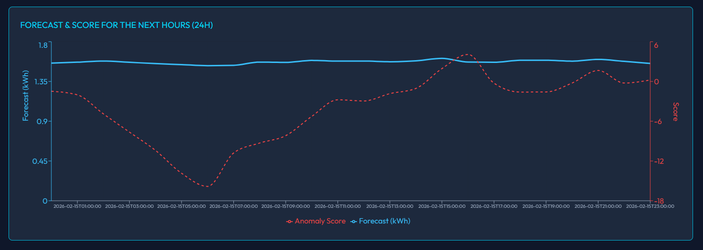
</p>

<p>f. Analysis the electricity usage on 16 February 2026</p>
<p>* Predict hidden states & Anomaly delection</p>
<p>Looking at the status chart for 16 February 2026, the system appears to be operating quite stably, with no peak periods during the day, as previously predicted.</p>
<p>Nhìn vào biểu đồ trạng thái ngày 16-02-2026 cho thấy hệ thống hoạt động khá ổn định, không có khoảng thời gian cao điểm trong ngày, đúng theo dự báo trước đó.</p>
<p align="center">
  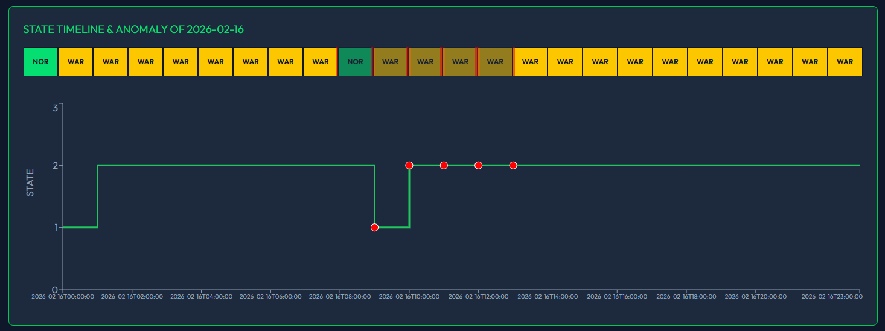
</p>

<p>* Forecast of energy consumption for the next 24 hours (17 February 2026)</p>
<p>Forecasts for the next 24 hours indicate that electricity consumption may peak at noon (10:00 AM, 17 February 2026) at 46.21 kWh and at night (7:00 PM, 17 February 2026) at 47.09 kWh.</p>
<p>Dự báo trong 24h tiếp theo, mức sử dụng điện năng có thể đạt đỉnh điểm vào lúc trưa (10h 2026-02-17) với 46,21 kWh và tối (19h 17/02/2026) là 47,09 kWh.</p>
<p align="center">
  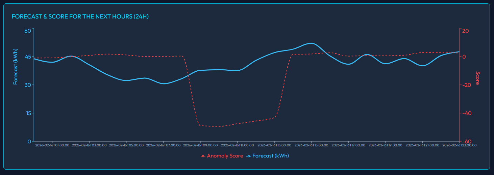
</p>

https://github.com/user-attachments/assets/55879641-cb0f-49be-9f60-3ca826b1b9fb

# VI. DEMONSTRATION
<div>

<p align="center">
  <a href="https://www.youtube.com/watch?v=00z3u6Ofh6w&t=75s">
    
  </a>
</p>

<h3>MOBILE FRIENDLY</h3>
<p align="center">
  <a href="https://www.youtube.com/watch?v=aQUQzm_U8xE">
    
  </a>
</p>
 
</div>

# VII. REQUIREMENTS
<div>
<p>Back-end</p>
<ul>
  <li>Spring Boot 3.5.6</li>
  <li>Tomcat server 10.1.31</li>
  <li>MySQL</li>
  <li>Redis</li>
  <li>Spring Boot Security</li>
  <li>Spring Boot WebSocket</li>
  <li>Spring Data JPA</li>
  <li>Hibernate core 6.6.18</li>
  <li>Lombok</li>
  <li>Spring Boot Validation</li>
  <li>Json Webtoken 0.9.1</li>
</ul>
<p>Front-end</p>
<ul>
  <li>React 18.3.1</li>
  <li>Docker</li>
  <li>Axios 1.13.2</li>
  <li>React redux 9.2.0</li>
  <li>React router 7.9.6</li>
  <li>React charts 3.5.1</li>
  <li>Sockjs client 1.6.1</li>
  <li>Ant design 5.28.1</li>
  <li>Vite Tailwindcss 4.1.17</li>
</ul>
<p>PLCs</p>
<ul>
  <li>PLC FX5UJ MITSUBISHI</li>
  <li>Socket TCP programming</li>
  <li>Modbus RS-485 communication</li>
</ul>
<p>Languages: Java, JavaScript, HTML & CSS, JSX</p>

# VIII. REFERENCES
<p>[1] Cuốn Bài tập Cung Cấp Điện - TS. Trần Quang Khánh</p>
<p>[2] Hidden Markov Model - Speech and Language Processing. Daniel Jurafsky & James H. Martin. https://web.stanford.edu/~jurafsky/slp3/A.pdf</p>
<p>[3] Household Electric Power Consumption - UCI Machine Learning. https://www.kaggle.com/datasets/uciml/electric-power-consumption-data-set</p>


